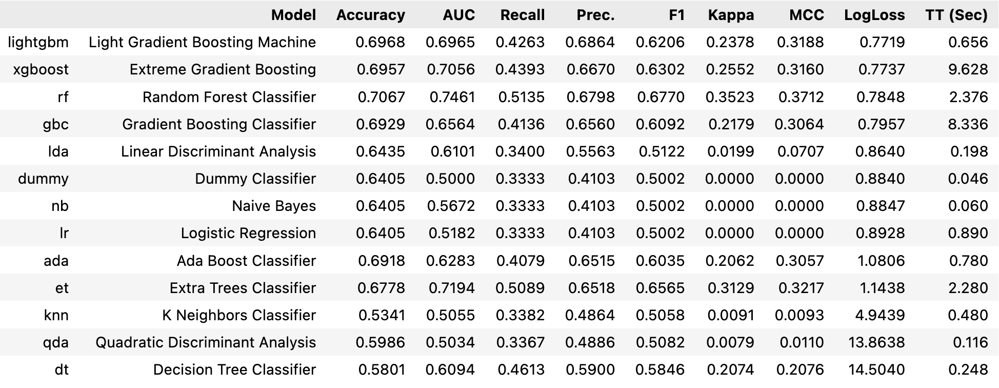

# Credit Now
  - [분석 목표 및 결과](#분석-목표-및-결과)
  - [학습 데이터](#학습-데이터)
  - [데이터 전처리](#데이터-전처리)
  - [모델 최적화](#모델-최적화)
    - [LIME](#lime)
    - [Pycaret](#pycaret)
    - [Keras Tuner](#keras-tuner)
  - [Tabnet](#tabnet)
  - [회고](#회고)

---

## 분석 목표 및 결과

- 신용카드 사용자 정보를 기반으로 사용자 신용카드 대금 연체 정도에 해당하는 신용도를 예측
- 모델의 성능도 중요하지만, 최대한 다양한 머신러닝 및 딥러닝 모델을 사용해보는 것을 목적으로 진행
- 결과적으로는 머신러닝의 Stacking Ensemble 방식을 통해 LogLoss 기준 `0.75462`  수치에 도달

---

## 학습 데이터

- [신용카드 사용자들의 개인 신상정보](https://dacon.io/competitions/official/235713/data)
- target 데이터에서 불균형이 확인되어 Validation 데이터 생성 시 Stratified를 적용할 필요성을 인지

<table align="center" style="border:hidden!important;">
<tr>
  <td>
    
  </td>
  <td>
    
  </td>
</tr>
</table>

---

## 데이터 전처리

- 범주형 데이터를 정수로 변환해 예측 결과를 확인해보는 간단한 과정을 우선적으로 진행
- 유일한 결측치인 직업유형 열의 경우 고용기간 열과 비교해 '무직'으로 채울지 행을 제거할지 결정
- 이후 대회 1등의 코드를 참고해 파생 변수를 생성하고 불필요한 열을 제거하여 기존 전처리와 비교

---

## 모델 최적화

- 모델 성능 개선을 위해 다양한 최적화 기법 시도

### LIME

- 데이터 전처리 개선을 위해 LIME을 활용해 모델의 판단 기준 파악
- 해당 구간에 속하는 정답 데이터의 비율을 원형 차트로 그려봤지만 유의미한 결과를 얻지 못함

### Pycaret

- 머신러닝 모델 성능 비교를 위해 Pycaret을 활용
- Stacking 작업에서 상위 3개 모델의 포함 여부가 LoLoss 성능에 결정적인 영향을 미침

### Keras Tuner

- 딥러닝 모델 성능 향상을 위해 Keras Tuner 활용
- 딥러닝 모델 중에서는 가장 낮은 LogLoss인 `0.80818` 수치 달성
- 성능 지표가 Accuracy로 설정된 아래 비교 결과에서 자체 설정 모델이나 Auto-Keras보다
Keras Tuner가 압도적인 성능을 보여줌을 알 수 있었고 레이어의 수는 큰 영향을 끼치지 않았음
    
    
    

## Tabnet

- 결과적으로는 예측 성능에 대해 전반적으로 머신 러닝 모델이 앞섰지만,   
다양한 모델을 사용해보는 것이 목적이었기에 Tabnet을 활용한 예측을 추가로 진행
- 마찬가지로 Accuracy를 기준으로 설정된 아래 비교 결과에서   
Adagard Optimizer가 압도적으로 좋았고, Epoch 수에서는 100보다 500이 미세하게 앞서는 결과를 보임
    
    
    

---

## 회고

- 딥러닝 모델보다 머신러닝 모델의 성능이 높게 나온 것에 대한 원인을 조사하던 중 발견한 [해당 논문](https://arxiv.org/abs/2106.03253)에 따르면   
정형 데이터에서 XGBoost 알고리즘이 다른 딥러닝 모델들보다 우수한 성능을 낸다는 것을 알 수 있었음
- 처음으로 사용한 Github 협업이기에 Brach를 개인 저장소 정도로 인식하고 시작한 것이 향후 특정 기능을 Merge할 때 문제가 된다는 것을 인지하고 다음 프로젝트부터는 기능 별로 Brach를 설정해야함을 깨달음
